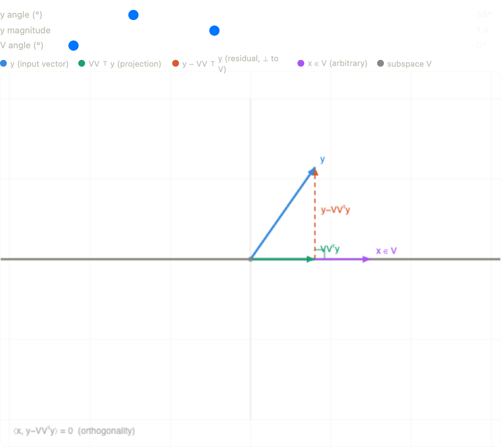

## 🚀 Introduction

Modern deep learning models—especially large transformer architectures like GPT-3—are dominated by matrix multiplication operations.

In a typical transformer:

- Attention requires computing $QK^\top$ and multiplying by $V$, costing $O(n^2 d)$  
- Feedforward layers involve dense $O(d^2)$ matrix multiplications  

With large hidden dimensions and sequence lengths, this leads to billions of operations per forward pass, making matrix multiplication the primary bottleneck for both training and inference.

---

## 💡 Key Principle

A central observation:

> **Most high-dimensional data admits a good low-rank approximation.**

This holds across:
- User preference data  
- Image representations  
- Neural network weights  

By projecting high-dimensional data into a lower-dimensional subspace, we can perform computation more efficiently while maintaining acceptable accuracy.

---

## 🧠 Practical Applications

- **LoRA (Low-Rank Adaptation)**  
  https://arxiv.org/pdf/2106.09685  

- **Fast Attention**  
  https://arxiv.org/pdf/2006.04768  
  https://arxiv.org/pdf/2001.04451  

These methods exploit low-rank structure to significantly reduce the cost of training and inference in modern deep learning systems.

## Projection Matrices: A Solid Foundation

Projection matrices are one of the cleanest ways to formalize the idea of reducing high-dimensional data to a lower-dimensional subspace while preserving as much useful structure as possible. This makes them a natural mathematical tool for later studying low-rank approximation, compression, and efficient computation.

Let $V \in \mathbb{R}^{d \times k}$ be a matrix with orthonormal columns:
$$
V = [v_1,\dots,v_k], \qquad V^T V = I_k.
$$
The columns of $V$ span a $k$-dimensional subspace
$$
\mathcal{V} = \operatorname{span}(v_1,\dots,v_k) \subseteq \mathbb{R}^d.
$$
The matrix
$$
P = VV^T
$$
is the projection matrix onto $\mathcal{V}$.

  

<em>
Projection of $y$ onto subspace $\mathcal{V}$
</em>

---

## Geometric Picture: What Are $x$, $y$, and $V$?

It helps to visualize the setup before proving anything.

- $y \in \mathbb{R}^d$ is an arbitrary vector in the ambient space.
- $V$ gives an orthonormal basis for the subspace $\mathcal{V}$.
- $x \in \mathcal{V}$ is any vector that already lies inside the subspace.
- $VV^T y$ is the projection of $y$ onto $\mathcal{V}$.

Geometrically, $y$ can be decomposed into two perpendicular pieces:
$$
y = VV^T y + (y - VV^T y).
$$
The first term lies in the subspace $\mathcal{V}$, and the second term is the residual orthogonal to $\mathcal{V}$.

---

## 1. Why Is the Residual Orthogonal to the Subspace?

We want to show that for any $x \in \mathcal{V}$,
$$
\langle x,\, y - VV^T y \rangle = 0.
$$

Since $x \in \mathcal{V}$, there exists some $c \in \mathbb{R}^k$ such that
$$
x = Vc.
$$
Then
$$
x^T(y - VV^T y)
= (Vc)^T(y - VV^T y)
= c^T V^T (y - VV^T y).
$$
Distribute $V^T$:
$$
c^T\bigl(V^T y - V^T V V^T y\bigr).
$$
Because the columns of $V$ are orthonormal, $V^T V = I_k$, so
$$
c^T\bigl(V^T y - I_k V^T y\bigr) = c^T(V^T y - V^T y) = 0.
$$
Therefore,
$$
\langle x,\, y - VV^T y \rangle = 0.
$$

So the residual $y - VV^T y$ is orthogonal to every vector in the subspace. This is exactly what makes $VV^T y$ an orthogonal projection.

---

## 2. Why Is $VV^T y$ the Closest Point in the Subspace?

Now we prove that
$$
VV^T y = \arg\min_{z \in \mathcal{V}} \|y-z\|_2^2.
$$

Take any $z \in \mathcal{V}$. Since both $z$ and $VV^T y$ lie in $\mathcal{V}$, their difference
$$
VV^T y - z
$$
also lies in $\mathcal{V}$.

From part (1), the residual
$$
y - VV^T y
$$
is orthogonal to the whole subspace, so in particular it is orthogonal to $VV^T y - z$. Therefore,
$$
y - z = (y - VV^T y) + (VV^T y - z)
$$
is an orthogonal decomposition. By the Pythagorean theorem,
$$
\|y-z\|_2^2
=
\|y - VV^T y\|_2^2 + \|VV^T y - z\|_2^2.
$$
The second term is always nonnegative, so
$$
\|y-z\|_2^2 \ge \|y - VV^T y\|_2^2,
$$
with equality if and only if
$$
VV^T y - z = 0,
$$
that is, when $z = VV^T y$.

So $VV^T y$ is the unique point in the subspace closest to $y$.

---

## 3. Why Does $VV^T = V^T V = I$ When $k=d$?

We already know that for an orthonormal matrix,
$$
V^T V = I.
$$
That always holds when the columns are orthonormal.

Now suppose $k=d$. Then $V$ is a square $d \times d$ matrix whose columns form an orthonormal basis of all of $\mathbb{R}^d$. In that case, the subspace $\mathcal{V}$ is the whole space:
$$
\mathcal{V} = \mathbb{R}^d.
$$
Projecting onto the whole space does nothing, so for every $y \in \mathbb{R}^d$,
$$
VV^T y = y.
$$
Since this is true for every vector $y$, we conclude
$$
VV^T = I_d.
$$
Thus when $V$ is square and orthonormal,
$$
VV^T = V^T V = I_d.
$$

So a square matrix with orthonormal columns also has orthonormal rows, and its inverse is its transpose.

---

## 4. Eigenvalues of $VV^T$

Finally, we show that $VV^T$ has exactly $k$ eigenvalues equal to $1$ and exactly $d-k$ eigenvalues equal to $0$.

First, every vector $x \in \mathcal{V}$ satisfies
$$
x = Vc
$$
for some $c$. Then
$$
VV^T x = VV^T(Vc) = V(V^T V)c = VI_k c = Vc = x.
$$
So every vector in $\mathcal{V}$ is an eigenvector with eigenvalue $1$. Since $\dim(\mathcal{V})=k$, there are at least $k$ such eigenvectors.

Next, if $x \perp \mathcal{V}$, then $V^T x = 0$, because $x$ is orthogonal to every column of $V$. Hence
$$
VV^T x = V(V^T x) = V0 = 0.
$$
So every vector in $\mathcal{V}^\perp$ is an eigenvector with eigenvalue $0$. Since
$$
\dim(\mathcal{V}^\perp)=d-k,
$$
there are at least $d-k$ such eigenvectors.

Because
$$
\mathbb{R}^d = \mathcal{V} \oplus \mathcal{V}^\perp,
$$
these two subspaces together account for all $d$ dimensions. Therefore, $VV^T$ has exactly:

- $k$ eigenvalues equal to $1$
- $d-k$ eigenvalues equal to $0$

This matches the intuition of a projection matrix: it keeps the component inside the subspace and removes the orthogonal component.

## From Projection to Random Projection

So far, we studied the exact projection matrix:
$$
P = VV^T,
$$
which gives the *best* low-rank approximation in a subspace.

However, computing such a projection explicitly can be expensive.

A powerful idea is to replace this with a **random projection**.

---

## Random Projection Setup

Let $\Pi \in \mathbb{R}^{n \times m}$ be a random matrix with entries:
$$
\Pi_{ij} =
\begin{cases}
\frac{1}{\sqrt{m}} & \text{with probability } 1/2 \\
-\frac{1}{\sqrt{m}} & \text{with probability } 1/2
\end{cases}
$$

We approximate:
$$
A^T A \quad \text{by} \quad A^T \Pi \Pi^T A.
$$

---

## Why Does This Work?

We are effectively projecting rows of $A$ into a lower-dimensional space:
- Original dimension: $n$
- Reduced dimension: $m \ll n$

The key result:

$$
\mathbb{E} \left[ \|A^T \Pi \Pi^T A - A^T A\|_F^2 \right]
\le \frac{2\|A\|_F^4}{m}.
$$

👉 As $m$ increases, the error shrinks.

---

## High Probability Guarantee

Using Markov's inequality, we get:

$$
\Pr\left(
\|A^T \Pi \Pi^T A - A^T A\|_F \ge \epsilon \|A\|_F^2
\right)
\le \frac{2}{\epsilon^2 m}.
$$

If we choose:
$$
m = \frac{20}{\epsilon^2},
$$

then:
$$
\Pr(\text{large error}) \le \frac{1}{10}.
$$

👉 With high probability (≥ 90%), the approximation is good.

---

## 🚀 Why This Matters

We replaced an exact computation with a **much cheaper approximation**.

### Exact computation
$$
A^T A: \quad O(nd^2)
$$

### Approximate computation
1. Compute $A^T \Pi$: $O(ndm)$  
2. Compute $A^T \Pi \Pi^T A$: $O(d^2 m)$  

Total:
$$
O(ndm + d^2 m)
$$

## 🔢 Concrete Example

Suppose:
- $n = 10^5$ (samples)
- $d = 10^3$ (features)
- $\epsilon = 0.1 \Rightarrow m \approx 2000$

### Exact:
$$
O(nd^2) = 10^5 \cdot 10^6 = 10^{11}
$$

### Approximate:
$$
O(ndm) = 10^5 \cdot 10^3 \cdot 2 \cdot 10^3 = 2 \cdot 10^{11}
$$
$$
O(d^2 m) = 10^6 \cdot 2 \cdot 10^3 = 2 \cdot 10^9
$$

👉 Already competitive, and improves further when:
- $d$ grows larger
- or structured projections are used

---

## 🧠 Intuition

Random projection behaves like a “cheap projection matrix”:

- $VV^T$ → optimal but expensive  
- $\Pi \Pi^T$ → approximate but fast  

Both:
- preserve inner products (approximately)
- preserve geometry
- enable dimensionality reduction

---

## 🔗 Connection Back to Deep Learning

This is exactly the principle behind:

- Low-rank updates (LoRA)
- Fast attention (random projections, sketching)

👉 Replace expensive high-dimensional operations with **compressed subspace computation**